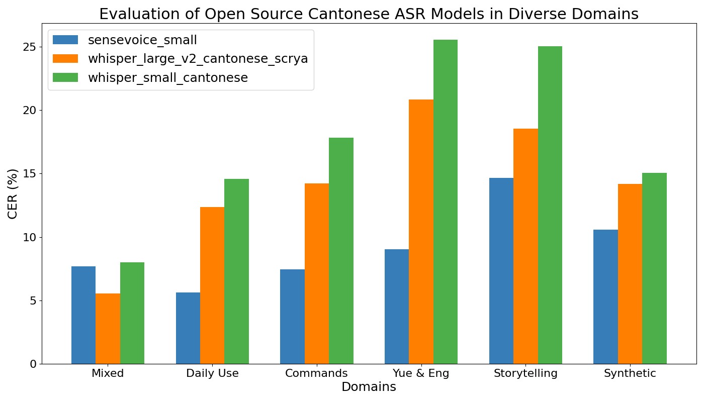

# Evaluation of Open Source Cantonese ASR Models in Diverse Domains


| Dataset      | sensevoice_small CER | whisper_large_v2_cantonese_scrya CER | whisper_small_cantonese CER |
|--------------|----------------------|--------------------------------------|-----------------------------|
| Mixed        | 7.70%                | 5.55%                                | 8.00%                       |
| Daily Use    | 5.64%                | 12.38%                               | 14.60%                      |
| Commands     | 7.45%                | 14.22%                               | 17.83%                      |
| Yue & Eng    | 9.05%                | 20.85%                               | 25.57%                      |
| Storytelling | 14.52%               | 19.44%                               | 22.53%                      |
| Synthetic    | 10.58%               | 14.20%                               | 15.05%                      |

## Open Source ASR Models
1. [SenseVoiceSmall](https://huggingface.co/FunAudioLLM/SenseVoiceSmall): Trained on 300,000 hours of multilingual speech, including almost 9600 hours of Cantonese speech, Alibaba's multilingual model shows state-of-the-art ASR capability in Chinese, English, Cantonese, Japanese, and Korean. Extremely low inference latency was achieved by employing a non-autoregressive end-to-end architecture.
2. [Scrya/whisper-large-v2-cantonese](https://huggingface.co/Scrya/whisper-large-v2-cantonese): This model is a fine-tuned version of openai/whisper-large-v2 on the mozilla-foundation/common_voice_11_0 dataset. It achieves a CER of 6.2133 on the evaluation set of Common Voice 11.
3. [alvanlii/whisper-small-cantonese](https://huggingface.co/alvanlii/whisper-small-cantonese): This model is a fine-tuned version of openai/whisper-small on the Cantonese language. It achieves a 7.93 CER (without punctuations), 9.72 CER (with punctuations) on Common Voice 16.0. In total, 934 hours of Cantonese speech are used for fine-tuning, with 138 hours from Common Voice 16.0 zh-HK Train, 85 hours from Common Voice 16.0 yue Train, 178 hours from Common Voice 17.0 yue Train, and 72 hours from Cantonese-ASR, 23 hours from CantoMap, and lastly 438 hours from Pseudo-Labelled YouTube videos.

## Datasets from Various Domains
1. **[Mixed]** [Common Voice 17.0](https://huggingface.co/datasets/mozilla-foundation/common_voice_17_0): Common Voice is a publicly available voice dataset, powered by the voices of volunteer contributors around the world. As of version 17.0, there are 178 hours of Cantonese audio under the yue language tag.
2. **[Daily Use]** [Guangzhou Daily Use](https://huggingface.co/datasets/AlienKevin/guangzhou-daily-use-speech): 4.06 hours of transcribed Guangzhou Cantonese scripted speech focusing on daily use sentences, where 4,060 utterances contributed by ten speakers were contained.
3. **[Commands]** [Guangzhou Cabin](https://huggingface.co/datasets/AlienKevin/guangzhou-cabin-speech): 5 hours of transcribed Guangzhou Cantonese scripted speech in the vehicle focusing on digits, commands and queries, where 6,219 utterances contributed by ten speakers were contained.
4. **[Yue & Eng]** [Mixed Cantonese and English](https://huggingface.co/datasets/AlienKevin/mixed_cantonese_and_english_speech): 34.8 hours of mixed Cantonese and English audio spanning 18 topics related to daily life. The corresponding annotated text consists of 307,540 Chinese characters and 70,132 English words. Among the topics, the "Food" category has the highest frequency of English words, with a Chinese character to English word ratio of approximately 3:1. On the other hand, the "Tech News" topic has the lowest frequency of English words, approximately 8:1.
5. **[Storytelling]** [Zoeng Jyutgaai's Romance of the Three Kingdomgs](https://huggingface.co/datasets/hon9kon9ize/zoengjyutgaai_saamgwokjinji): 307 utterances by Cantonese storyteller Zoeng Jyutgaai (張悦楷) on the classical work "Romance of the three kingdoms".
6. **[Synthetic]** [words.hk sentences generated with AWS Polly](https://huggingface.co/datasets/AlienKevin/wordshk_cantonese_speech): 115K utterances generated with AWS Polly's Cantnoese voice Hiujin. Sentences are sourced from the the definitions and examples of the words.hk dictionary.

## Discussion

1. SenseVoice Small leads in all domains except the mixed domain. The two Whisper models are fine-tuned on subsets of the Common Voice 17.0 dataset. Impressively, SenseVoice Small still outperforms Whisper Small Cantonese on CV 17 Test.
2. The Whisper models struggle the most on the Cantonese-English code switching domain, which can be explained by the lack of code switching sentences in the Common Voice dataset they are fine-tuend on.
3. The second most difficult domain is the storytelling domain. It is challenging because the story used in evaluation, Romance of the Three Kingdoms, contains many historical names and places, which are rarely seen in the training data.
4. Overall, SenseVoice shows remarkable generalization capability across various domains while Whisper models suffer significant precision loss on domains that are not fine-tuned on. This shows that more diverse training data needs to be curated for developing more robust Whisper models.

## Filtering and Postprocessing

### Filtering
1. All utterances from the test set of Common Voice 17.0 are kept.
2. The first 1,000 utterances are chosen for evaluation for each of the other datasets.

### Postprocessing
1. Convert all Chinese characters.
2. Strip away all punctuations and spaces.
3. Remove any emotion or event tags (sensevoice only).

## Reproduction

### Environment
```
pip install funasr transformers torch torchaudio datasets librosa matplotlib tqdm
```
See the `environment.yml` for a reference conda environment on the macOS.

### Evaluate
```
python run.py
```

Generated outputs of all the models can be found under the `results/` folder.

Then, you can calculate the character error rate for the results using:
```
python eval.py
```
